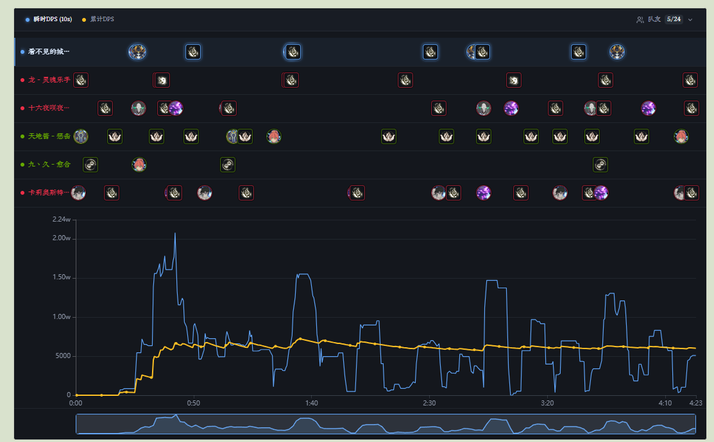
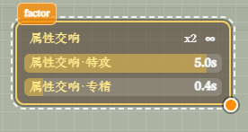

# Changelog v0.2.1

## 更新内容

### DPS / 历史

- 重构战斗管线：历史记录详细落段，并支持任意时间线查找

  

- Live 计时器改为直接使用后端计时

### 实时监控相关

- 自定义计数因子区适配 S4 节点 Buff 效果，自动监听并展示

  

- 炎角计算新增狂音技能

### 语音播报

- 新增中文 / 英文 / 日文预置音色默认选择（按界面语言自动选用）
- 微调模型校验结果持久化，避免启动时重复计算

### 监控方案

- 修复导出 / 导入时缺失字段导致无法导入老版本方案

### 稳定性

- 修复在游戏按住 alt 呼出鼠标后点击关闭最小化会整体未响应的问题, 拦截 `WM_NCLBUTTONDOWN`，避免内核嵌套跟踪循环
- 修复可能出现的 `monitorRuntime` 并发读写问题, 导致配置没有完全加载的问题

## 注意事项

### 兼容性提醒

- 如果之前使用过 0.0.2 或 0.0.3，第一次使用 0.0.4-0.2.1 需要清理 `%LOCALAPPDATA%\resonance-logs-cn` 目录下的 `resonance-logs-cn.db`，再重新启动应用
- 0.2.1 由于重构了后端管线, 若原有功能出现问题请及时联系我
- 语音播报需单独下载模型；首次生成短句可能耗时较长，生成完成后播放不再加载模型

### 特别注意

- 如果你自己修改了代码又不想提交 PR，在分享给其他人的时候请把应用名、版本号等原版相关信息都改掉，不要带着原仓库的信息，尤其是应用名和版本号
- 关闭按钮现在会隐藏到右下角，可以将隐藏栏的内容拖到右下角显示，避免窗口程序过多时无法快速找到
- 常见问题见使用手册中的 HTML

### 社区

- QQ 群：`1084866292`
- Discord：https://discord.gg/RHeX47wvDU
