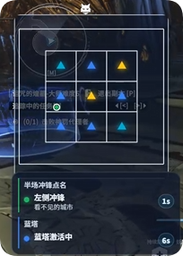
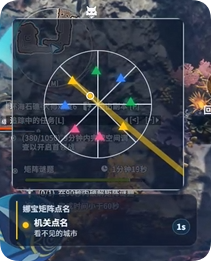
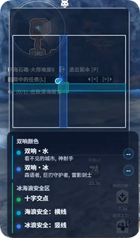

# 副本机制

对应工具箱中的 **副本机制**，在游戏内独立浮窗实时展示当前副本的站位、点名与机制预警。

与 **怪物监控**、**实时监控** 相互独立：使用 **副本机制遮罩**（minimap-overlay）窗口，仅在已适配的副本场景内自动激活。

## 概述

副本机制浮窗由两个可独立开关的面板组成：

| 面板 | 说明 |
|------|------|
| **地图面板** | 俯视角小地图：显示自己、队友、Boss 及机制相关点位；用颜色、区域、连线标注分摊、安全区、危险半区等 |
| **机制报幕** | 文字列表：当前进行中的机制名称、点名对象与剩余时间倒计时 |

进入已支持的副本后，应用会根据场景 ID 自动加载对应机制解析逻辑；离开副本或进入未适配场景时，浮窗不再显示机制内容。

## 启用与顶栏操作

在 **副本机制** 页顶栏：

- **开关副本机制窗口**：显示或隐藏游戏内副本机制浮窗。
- **编辑布局**：进入布局编辑模式，拖动、缩放地图面板与机制报幕的位置和尺寸。

## 显示选项

| 选项 | 说明 |
|------|------|
| **日常场景自动隐藏** | 进入日常场景黑名单时自动隐藏浮窗，离开后恢复之前的显示状态 |
| **仅显示自己与被机制影响的队友** | 隐藏普通站位队友；被机制点名或 Buff 染色的队友会自动显示 |
| **显示 Boss 位置** | 在小地图中标注 Boss 点位（默认关闭，减少干扰） |

## 玩家颜色与自身标记

- **玩家颜色**：无机制覆盖时，自己与队友在小地图上的默认颜色。
- **自身同心圆**：在自己圆点外叠加一圈描边，即使被机制点名变色也能快速定位自己（颜色、线宽可调）。

## 面板可见性

可在设置页分别开关 **地图面板** 与 **机制报幕**。面板位置与宽度请在浮窗 **编辑布局** 模式中调整。

## 已支持副本

| 副本 | 场景 ID | 机制概要 |
|------|---------|----------|
| **诅咒煌墓**（墓煌） | 6513 / 6514 / 6515 | 蓝塔激活、能量柱点名、半场冲锋、冲锋分身等 |
| **环海石礁**（深海娜宝） | 6563 / 6564 / 6565 | 矩阵符文机关（道中）、Boss 双响颜色、冰/海浪安全区与十字线等 |
| **遗忘幻梦之野** | 13021 / 13022 / 13023 | 相位地块、分摊/衰减/分散、因果折跃、累刎宣告、电磁环序列、弹球等 |
| **S3 巨塔** | 1150 / 1151 / 1152 | 正确传送门颜色提示 |

> 机制名称以浮窗内显示为准；不同难度（普通 / 困难 / 大师）共用同一套解析，场景 ID 不同。

## 效果示例

### 诅咒煌墓（墓煌）

地图面板标注蓝塔进度、能量柱与冲锋相关点位；机制报幕同步显示当前阶段与倒计时。

### 环海石礁 · 道中矩阵（深海娜宝）

矩阵阶段的符文颜色、机关点名与队友站位。

### 环海石礁 · Boss（深海娜宝）

Boss 战的双响颜色、冰/海浪安全区与十字交点等区域标注。

## 与怪物监控 Boss DBM 的区别

| 项目 | 副本机制 | 怪物监控 · Boss DBM |
|------|----------|---------------------|
| 浮窗 | 副本机制遮罩 | 怪物遮罩 |
| 主要信息 | 站位地图 + 机制报幕 | Boss 技能预警条（技能名 + 倒计时） |
| 适用场景 | 已适配副本 | 任意有 Boss DBM 事件的战斗 |
| 配置入口 | 副本机制页 | 怪物监控 → Boss DBM |

两者可同时开启，分别放在屏幕不同位置，互补使用。
